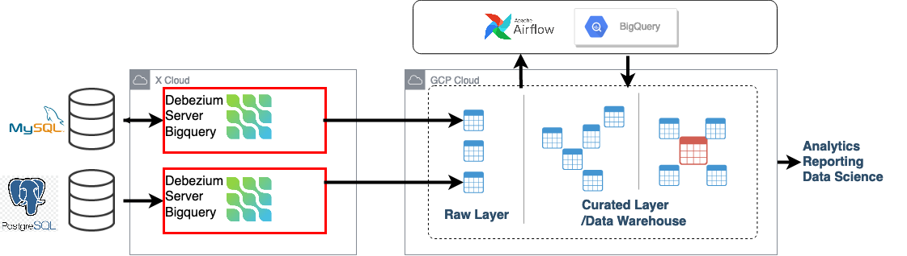

[](http://www.apache.org/licenses/LICENSE-2.0.html)


# Table of contents

* [Debezium Bigquery Consumers](#debezium-bigquery-consumers)
    * [`bigquerybatch` Consumer (Uses BQ Free API)](#bigquerybatch-consumer)
    * [`bigquerystream` Consumer](#bigquerystream-consumer)
* [Install from source](#install-from-source)

# Debezium Bigquery Consumers

This project adds Bigquery consumers
to [Debezium Server](https://debezium.io/documentation/reference/operations/debezium-server.html).
This consumer replicates RDBMS CDC events to Bigquery in real time.



## `bigquerybatch` Consumer

Writes debezium events to Bigquery
using [BigQuery Storage Write API](https://cloud.google.com/bigquery/docs/write-api).
It groups CDC events and appends to destination BigQuery
table [using BigQuery Write API](https://cloud.google.com/bigquery/docs/batch-loading-data#loading_data_from_local_files)

| Config                                               | Default            | Description                                                                                                |
|------------------------------------------------------|--------------------|------------------------------------------------------------------------------------------------------------|
| `debezium.sink.bigquerybatch.dataset`                |                    | Destination Bigquery dataset name                                                                          |
| `debezium.sink.bigquerybatch.location`               | `US`               | Bigquery table location                                                                                    |
| `debezium.sink.bigquerybatch.project`                |                    | Bigquery project                                                                                           |
| `debezium.sink.bigquerybatch.create-disposition`     | `CREATE_IF_NEEDED` | Create tables if needed                                                                                    |
| `debezium.sink.bigquerybatch.partition-field`        | `__ts_ms`          | Partition target tables by `__ts_ms` field                                                                 |
| `debezium.sink.bigquerybatch.clustering-field`       | `__source_ts_ms`   | Cluster target tables by `PK + __source_ts_ms` field                                                       |
| `debezium.sink.bigquerybatch.partition-type`         | `MONTH`            | Partitioning type                                                                                          |
| `debezium.sink.bigquerybatch.allow-field-addition`   | `true`             | Allow field addition to target tables                                                                      |
| `debezium.sink.bigquerybatch.allow-field-relaxation` | `true`             | Allow field relaxation                                                                                     |
| `debezium.sink.bigquerybatch.credentials-file`       |                    | GCP service account credentialsFile                                                                        |
| `debezium.sink.bigquerybatch.cast-deleted-field`     | `false`            | Cast deleted field to boolean type(by default it is string type)                                           |
| `debezium.sink.bigquerybatch.writeDisposition`       | `WRITE_APPEND`     | Specifies the action that occurs if the destination table or partition already exists.                     |
| `debezium.sink.bigquerybatch.bigquery-custom-host`   |                    | Custom endpoint for BigQuery API. Useful for testing against a local BigQuery emulator like `bq-emulator`. |
| `debezium.sink.bigquerybatch.bigquery-dev-emulator`  | `false`            | Whether or not Debezium should connect to `bq-emulator` instance.                                          |

## `bigquerystream` Consumer

Streams debezium events to Bigquery using
the [Storage Write API](https://cloud.google.com/bigquery/docs/write-api-streaming).

| Config                                                   | Default          | Description                                                                                                                            |
|----------------------------------------------------------|------------------|----------------------------------------------------------------------------------------------------------------------------------------|
| `debezium.sink.bigquerystream.dataset`                   |                  | Destination Bigquery dataset name                                                                                                      |
| `debezium.sink.bigquerystream.location`                  | `US`             | Bigquery table location                                                                                                                |
| `debezium.sink.bigquerystream.project`                   |                  | Bigquery project                                                                                                                       |
| `debezium.sink.bigquerystream.ignore-unknown-fields`     | `true`           | if true, unknown Json fields to BigQuery will be ignored instead of error out.                                                         |
| `debezium.sink.bigquerystream.create-if-needed`          | `true`           | Creates Bigquery table if not found                                                                                                    |
| `debezium.sink.bigquerystream.partition-field`           | `__ts_ms`        | Partition target tables by `__ts_ms` field                                                                                             |
| `debezium.sink.bigquerystream.clustering-field`          | `__source_ts_ms` | Cluster target tables by `PK + __source_ts_ms` field                                                                                   |
| `debezium.sink.bigquerystream.partition-type`            | `MONTH`          | Partitioning type                                                                                                                      |
| `debezium.sink.bigquerystream.allow-field-addition`      | `false`          | Allow field addition to target tables                                                                                                  |
| `debezium.sink.bigquerystream.credentials-file`          |                  | GCP service account credentialsFile                                                                                                    |
| `debezium.sink.bigquerystream.bigquery-custom-host`      |                  | Custom endpoint for BigQuery API. Useful for testing against a local BigQuery emulator like `bq-emulator`.                             |
| `debezium.sink.bigquerystream.bigquery-custom-grpc-host` |                  | Custom endpoint for BigQuery GRPC API. Useful for testing against a local BigQuery emulator like `bq-emulator`.                        |
| `debezium.sink.bigquerystream.bigquery-dev-emulator`     | `false`          | Whether or not Debezium should connect to `bq-emulator` instance.                                                                      |
| `debezium.sink.bigquerystream.upsert`                    | `false`          | Running upsert mode overwriting updated rows. Using [Bigquery CDC feature](https://cloud.google.com/bigquery/docs/change-data-capture) |
| `debezium.sink.bigquerystream.upsert-keep-deletes`       | `true`           | With upsert mode, keeps deleted rows in bigquery table.                                                                                |
| `debezium.sink.bigquerystream.upsert-dedup-column`       | `__source_ts_ns` | With upsert mode used to deduplicate data. row with highest `__source_ts_ns` is kept.                                                  |
| `debezium.sink.bigquerystream.upsert-op-column`          | `__op`           | Used with upsert mode to deduplicate data when `__source_ts_ns` of rows are same.                                                      |
| `debezium.sink.bigquerystream.cast-deleted-field`        | `false`          | Cast deleted field to boolean type(by default it is string type)                                                                       |

## Shared and Debezium Configs

| Config                                                        | Default                                                         | Description                                                                                                |
|---------------------------------------------------------------|-----------------------------------------------------------------|------------------------------------------------------------------------------------------------------------|
| `debezium.sink.batch.destination-regexp`                      | ``                                                              | Regexp to modify destination. With this its possible to map `table_ptt1`,`table_ptt2` to `table_combined`. |
| `debezium.sink.batch.destination-regexp-replace`              | ``                                                              | Regexp Replace part to modify destination                                                                  |
| `debezium.sink.batch.batch-size-wait`                         | `NoBatchSizeWait`                                               | Batch size wait strategy to optimize data files and upload interval. explained below.                      |
| `debezium.sink.batch.batch-size-wait.max-wait-ms`             | `300000`                                                        |                                                                                                            |
| `debezium.sink.batch.batch-size-wait.wait-interval-ms`        | `10000`                                                         |                                                                                                            |
| `debezium.source.max.batch.size`                              | `2048`                                                          |                                                                                                            |
| `debezium.format.value`                                       | `json`                                                          |                                                                                                            |
| `debezium.format.key`                                         | `json`                                                          |                                                                                                            |
| `debezium.source.time.precision.mode`                         | `isostring`                                                     |                                                                                                            |
| `debezium.source.decimal.handling.mode`                       | `double`                                                        |                                                                                                            |
| `debezium.format.value.schemas.enable`                        | `true`                                                          |                                                                                                            |
| `debezium.format.key.schemas.enable`                          | `true`                                                          |                                                                                                            |
| `debezium.source.offset.storage`                              | `io.debezium.server.bigquery.offset.BigqueryOffsetBackingStore` |                                                                                                            |
| `debezium.source.offset.storage.bigquery.table-name`          | `_debezium_offset_storage`                                      |                                                                                                            |
| `debezium.source.schema.history.internal`                     | `io.debezium.server.bigquery.history.BigquerySchemaHistory`     |                                                                                                            |
| `debezium.source.schema.history.internal.bigquery.table-name` | `_debezium_database_history_storage`                            |                                                                                                            |
| `debezium.transforms`                                         | `unwrap`                                                        |                                                                                                            |
| `debezium.transforms.unwrap.type`                             | `io.debezium.transforms.ExtractNewRecordState`                  |                                                                                                            |
| `debezium.transforms.unwrap.add.fields`                       | `op,table,source.ts_ms,db,ts_ms,ts_ns,source.ts_ns`             |                                                                                                            |
| `debezium.transforms.unwrap.delete.handling.mode`             | `rewrite`                                                       |                                                                                                            |
| `debezium.transforms.unwrap.drop.tombstones`                  | `true`                                                          |                                                                                                            |

## Data type mapping

For detailed information on data type mapping between Debezium and BigQuery, refer to the [documentation](docs/DOCS.md)

### Upsert

By default, Bigquery Streaming consumer is running with append mode
`debezium.sink.bigquerystream.upsert=false`.
Upsert mode uses source Primary Key and does upsert on target table(delete followed by insert). For the tables without
Primary Key consumer falls back to append mode.

#### Upsert Mode Data Deduplication

With upsert mode data deduplication is done. Deduplication is done based on `__source_ts_ns` value and event type `__op`
.
its is possible to change this field using `debezium.sink.bigquerystream.upsert-dedup-column=__source_ts_ns` (Currently
only
Long field type supported.)

Operation type priorities are `{"c":1, "r":2, "u":3, "d":4}`. When two records with same key and same `__source_ts_ns`
values received then the record with higher `__op` priority is kept and added to destination table and duplicate record
is dropped from stream.

### Mandatory config

#### Debezium Event format and schema

```properties
debezium.format.value=json
debezium.format.key=json
debezium.format.schemas.enable=true
```

#### Flattening Event Data

Bigquery consumers requires event flattening, please
see [debezium feature](https://debezium.io/documentation/reference/configuration/event-flattening.html#_configuration)

```properties
debezium.transforms=unwrap
debezium.transforms.unwrap.type=io.debezium.transforms.ExtractNewRecordState
debezium.transforms.unwrap.add.fields=op,table,lsn,source.ts_ms,source.ts_ns
debezium.transforms.unwrap.add.headers=db
debezium.transforms.unwrap.delete.handling.mode=rewrite
```

### Optimizing batch size (or commit interval)

Debezium extracts database events in real time and this could cause too frequent commits or too many small files
which is not optimal for batch processing especially when near realtime data feed is sufficient.
To avoid this problem following batch-size-wait classes are used.

Batch size wait adds delay between consumer calls to increase total number of events received per call and meanwhile
events are collected in memory.
This setting should be configured together with `debezium.source.max.queue.size` and `debezium.source.max.batch.size`
debezium properties

#### NoBatchSizeWait

This is default configuration, by default consumer will not use any wait. All the events are consumed immediately.

#### MaxBatchSizeWait

MaxBatchSizeWait uses debezium metrics to optimize batch size.
MaxBatchSizeWait periodically reads streaming queue current size and waits until number of events reaches
to `max.batch.size` or until `debezium.sink.batch.batch-size-wait.max-wait-ms`.

Maximum wait and check intervals are controlled by `debezium.sink.batch.batch-size-wait.max-wait-ms`
, `debezium.sink.batch.batch-size-wait.wait-interval-ms` properties.

example setup to receive ~2048 events per commit. maximum wait is set to 30 seconds, streaming queue current size
checked every 5 seconds

```properties
debezium.sink.batch.batch-size-wait=MaxBatchSizeWait
debezium.sink.batch.metrics.snapshot-mbean=debezium.postgres:type=connector-metrics,context=snapshot,server=testc
debezium.sink.batch.metrics.streaming-mbean=debezium.postgres:type=connector-metrics,context=streaming,server=testc
debezium.source.connector.class=io.debezium.connector.postgresql.PostgresConnector
debezium.source.max.batch.size=2048;
debezium.source.max.queue.size=16000";
debezium.sink.batch.batch-size-wait.max-wait-ms=30000
debezium.sink.batch.batch-size-wait.wait-interval-ms=5000
```
##  BigqueryOffsetBackingStore Offset Storage
This implementation saves CDC offset to a bigquery table.

```
debezium.source.offset.storage=io.debezium.server.bigquery.offset.BigqueryOffsetBackingStore
debezium.source.offset.storage.bigquery.table-name=debezium_offset_storage_custom_table
```

## BigquerySchemaHistory Database History Storage
This implementation saves database history to a bigquery table.

```properties
debezium.source.database.history=io.debezium.server.bigquery.history.BigquerySchemaHistory
debezium.source.database.history.bigquery.table-name=__debezium_database_history_storage_test_table
```

## Configuring log levels

```properties
quarkus.log.level=INFO
# Ignore messages below warning level from Jetty, because it's a bit verbose
quarkus.log.category."org.eclipse.jetty".level=WARN
#
```

# Install from source

- Requirements:
    - JDK 21
    - Maven
- Clone from repo: `git clone https://github.com/memiiso/debezium-server-bigquery.git`
- From the root of the project:
    - Build and package debezium server: `mvn -Passembly -Dmaven.test.skip package`
    - After building, unzip your server
      distribution: `unzip debezium-server-bigquery-dist/target/debezium-server-bigquery-dist*.zip -d appdist`
    - cd into unzipped folder: `cd appdist`
    - Create `application.properties` file and config it: `nano conf/application.properties`, you can check the example
      configuration
      in [application.properties.example](debezium-server-bigquery-sinks/src/main/resources/conf/application.properties.example)
    - Run the server using provided script: `bash run.sh`

# Contributing

The Memiiso community welcomes anyone that wants to help out in any way, whether that includes reporting problems,
helping with documentation, or contributing code changes to fix bugs, add tests, or implement new features.

### Contributors

<a href="https://github.com/memiiso/debezium-server-bigquery/graphs/contributors">
  
</a>
